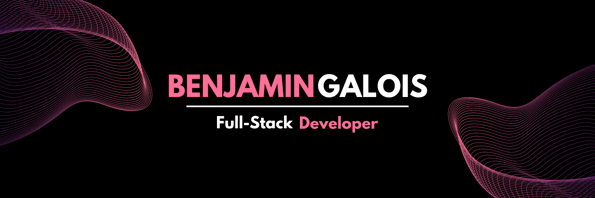

   
  
 

        
      

----

## 🙋‍♂️ About me

- ‍👨🏻‍🎓 I am a self-taught and passionate full-stack developer
- 🎓 Holder of the professional title of web and mobile web developer
- 🎖️ Holder of the OPQUAST certification [S1XUEW](https://directory.opquast.com/en/certificat/S1XUEW/)
- 🏠 I live in Paris, France 🇫🇷
- 💼 FullStack developer at [Mintec](https://www.mintecglobal.com/) & [CommoPrices](https://www.commoprices.com/)
- ❤️ I love coding with Laravel every days & drink coffee ☕

----
## 🧠 Skills

## 📊 Github Stats

   

        
        
   

## 📚 Language Usage

   
  
      
   

## 📊 Github Contribution Graph

   
  
        
   

## 🏆 Trophies

   
 
        
   

